# Smart Infrastructure Watchdog

Core tasks implemented:
1. Analyze `access.log` and produce the top IP addresses with hit counts.
2. Detect suspicious IP & add option to block the IP address with `iptables`
3. Run a Python HTTP health check that prints & send alert through email: `healthy` or `error`
4. Remove everything under `DB_ROOT` modified in the last `CLEANUP_DAYS` days, without deleting `DB_ROOT` itself.
5. Archieve old reports into gz files
6. Configured Cron automation to scheduled run each scripts
7. Deployed Flask dashboard to visualize Health Status, Suspicious IPs, Blocked IPs, Cleanup, Top IPs by Hit, & Log Viewer
8. Included Prometheus metrics endpoint for direct integration with Grafana

## Actual project structure

```text
smart-watchdog/
├── archive/
├── config/
│   └── watchdog.conf
├── cron/
│   └── watchdog.cron
├── dashboard/
│   └── app.py
├── demo/
│   ├── database/db/
│   └── setup_demo_env.sh
├── grafana/
│   ├── dashboards/
│   │   └── smart-watchdog.json
│   └── provisioning/
│       ├── dashboards/watchdog.yaml
│       └── datasources/prometheus.yaml
├── logs/
│   └── access.log
├── prometheus/
│   └── prometheus.yml
├── reports/
├── requirements.txt
├── scripts/
│   ├── alert.py
│   ├── analyze_top_ips.sh
│   ├── block_suspicious_ips.sh
│   ├── cleanup_recent.sh
│   ├── generate_dashboard.sh
│   ├── health_check.py
│   ├── rotate_reports.sh
│   ├── run_watchdog.sh
│   └── start_dashboard.sh
└── README.md
```

## How the data flow works

The Flask dashboard is file-driven.

1. `analyze_top_ips.sh` reads `logs/access.log` and writes:
   - `reports/top_ips_YYYY-MM-DD.txt`
   - `reports/suspicious_ips_YYYY-MM-DD.txt`
2. `block_suspicious_ips.sh` optionally reads suspicious IPs and writes:
   - `reports/blocked_ips_YYYY-MM-DD.txt`
3. `cleanup_recent.sh` removes matching paths under `DB_ROOT` and writes:
   - `reports/cleanup_YYYY-MM-DD.log`
4. `health_check.py` calls `HEALTH_URL` and writes:
   - `reports/health_YYYY-MM-DD.log`
5. `generate_dashboard.sh` reads the latest report files and creates:
   - `reports/dashboard.txt`
6. `dashboard/app.py` reads those same report files and displays them at `/`, while also exporting Prometheus metrics at `/metrics`.

## Script details

### `scripts/analyze_top_ips.sh`
Reads the first field from `ACCESS_LOG_FILE`, counts IP occurrences, sorts by highest count, and writes `<ip> <count>` lines to the daily top-IP report.

It also writes suspicious IPs to a separate file when counts exceed `SUSPICIOUS_THRESHOLD`.

If `BLOCK_SUSPICIOUS_IPS=1`, it calls `block_suspicious_ips.sh`.

### `scripts/block_suspicious_ips.sh`
Reads suspicious IPs and, if enabled, inserts drop rules into a dedicated `iptables` chain.

### `scripts/cleanup_recent.sh`
Deletes files and directories under `DB_ROOT` modified within the last `CLEANUP_DAYS` days.

Behavior:
- `DB_ROOT` itself is never removed
- it prints each removed full path once
- deeper paths are removed before parent directories
- removals are logged to `CLEANUP_LOG_FILE`

### `scripts/probe_ips.py`
This step enriches the top IP list with extra probe details.

Behavior:
- reads up to `PROBE_TOP_N` targets
- records IP properties such as version, private/global, loopback, reserved, and multicast
- skips non-global IPs unless `PROBE_INCLUDE_PRIVATE=1`
- can perform reverse DNS lookup when `PROBE_REVERSE_DNS=1`
- can test TCP connectivity to configured ports when `PROBE_CONNECT_ENABLED=1`

### `scripts/health_check.py`
Reads one integer pause time from stdin.

Behavior:
- sends GET requests to `HEALTH_URL`
- on HTTP 200, prints exactly `healthy`
- on repeated failure past the allowed threshold, prints exactly `error`
- appends detailed attempt logs to `HEALTH_LOG_FILE`
- can trigger `alert.py` 

### `scripts/alert.py`
Connects to Postfix as the local SMTP server using port `25`. Postfix handles the actual mail relay.

Behavior:
- accepts 2 arguments: `<subject>` and `<message>`
- uses `ALERT_EMAIL_FROM` and `ALERT_EMAIL_TO` for the message headers
- sends both plain text and HTML email content
- marks the HTML email as Critical Alert when the subject contains keywords such as `ALERT`, `CRITICAL`, `FAIL`, or `ERROR`
- if SMTP sending fails, it prints `[ALERT FALLBACK] ...`

### `scripts/generate_dashboard.sh`
Builds `reports/dashboard.txt` from the latest health, cleanup, suspicious, blocked, and top-IP reports.

### `scripts/run_watchdog.sh`
Runs the main producer flow in order:
1. analyze top IPs
2. cleanup recent items
3. run the health check
4. regenerate `dashboard.txt`

### `scripts/rotate_reports.sh`
Archives aged files from `reports/` into `archive/*.tar.gz` and removes old archives beyond the configured retention.

### `scripts/start_dashboard.sh`
Loads `config/watchdog.conf`, exports the required environment variables, and starts the Flask dashboard.

## Configuration

Main config file:

```bash
config/watchdog.conf
```

Important variables:

```bash
ACCESS_LOG_FILE
TOP_N
SUSPICIOUS_THRESHOLD
BLOCK_SUSPICIOUS_IPS
IPTABLES_DRY_RUN
HEALTH_URL
HEALTH_MAX_FAILURES
DB_ROOT
CLEANUP_DAYS
REPORT_DIR
DASHBOARD_FILE
FLASK_HOST
FLASK_PORT
```

## Requirements

### Arch Linux packages

```bash
sudo pacman -S --needed bash findutils gawk python python-requests
```

### Python packages for the dashboard and metrics

```bash
python -m venv .venv
source .venv/bin/activate
pip install -r requirements.txt
```

## Safe local test setup

Because cleanup is destructive, use the demo tree first.

### 1. Prepare demo data

```bash
chmod +x demo/setup_demo_env.sh
./demo/setup_demo_env.sh
```

### 2. Point `DB_ROOT` to the demo path

Edit `config/watchdog.conf` and set:

```bash
DB_ROOT="/home/smart-watchdog/demo/database/db"
```

### 3. Make scripts executable

```bash
chmod +x scripts/*.sh scripts/*.py
```

## Run each part manually

### Top IP analysis

`SUSPICIOUS_THRESHOLD` was set to 2 hits, any IP hits more than 2 will be marked as SUSPICIOUS

```bash
./scripts/analyze_top_ips.sh
```

Output report:

```bash
find -type f -name watchdog.conf -exec grep "SUSPICIOUS_THRESHOLD" {} +
```
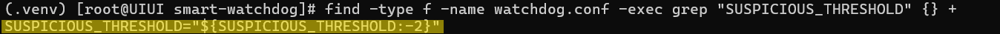

```bash
cat reports/suspicious_ips_2026-03-14.txt
```
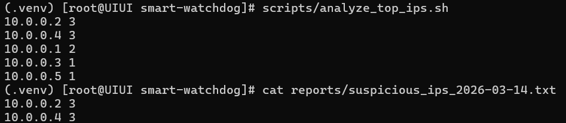

### Probe top IPs

```bash
python3 scripts/probe_ips.py
```

Output report:
```bash
cat reports/probe_2026-03-15.jsonl
```

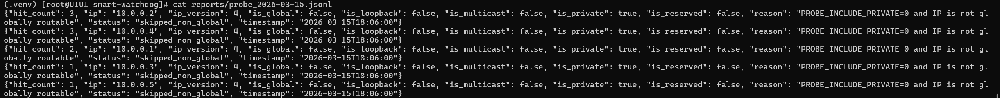

```bash
cat reports/probe_2026-03-15.log
```

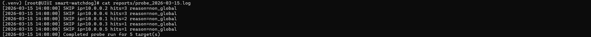

### Cleanup

`DB_ROOT` was `/home/smart-watchdog/demo/database/db`

`CLEANUP_DAYS` was set to 1 day, any files or folder older than 1 days will be deleted & record stored inside `CLEANUP_LOG_FILE`

```bash
./scripts/cleanup_recent.sh
find -type f -name watchdog.conf -exec grep -E 'DB_ROOT|CLEANUP_DAYS' {} +
```

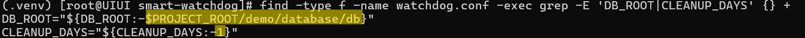

Before:

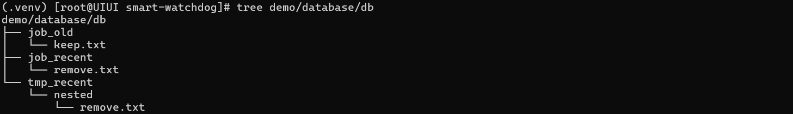

After:

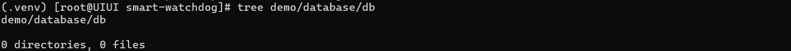

```bash
cat reports/cleanup_2026-03-15.log
```
//image of cleanup*.log

### Health check

`HEALTH_URL` was `http://example.com`

```bash
printf '2\n' | python3 scripts/health_check.py
```

Output:
- `healthy`

  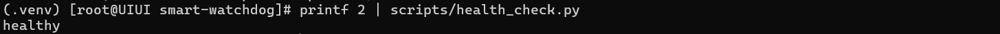

- `error`

  Alert sent to Admin
  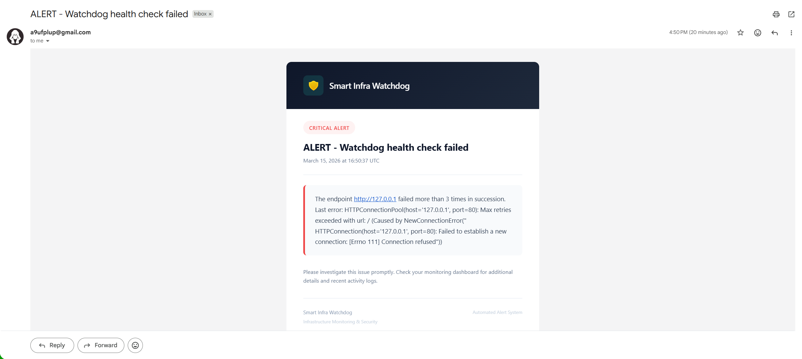

Log file:

```bash
cat reports/health_2026-03-14.log
```

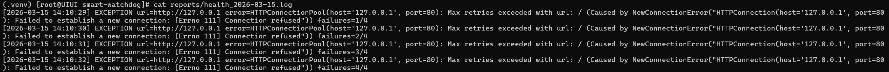

### Generate text dashboard

```bash
./scripts/generate_dashboard.sh
cat reports/dashboard.txt
```

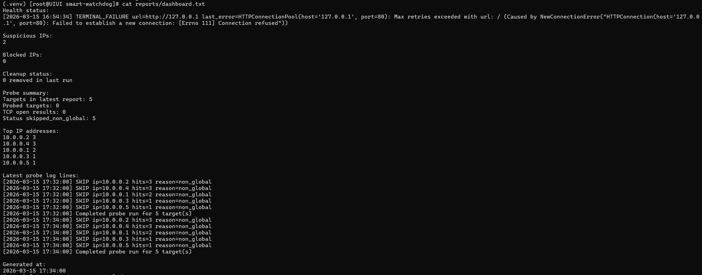

### Run the full producer flow

```bash
./scripts/run_watchdog.sh 2
```

## Start the Flask dashboard

```bash
./scripts/start_dashboard.sh
```

Open in browser:

```text
http://127.0.0.1:5000/
```

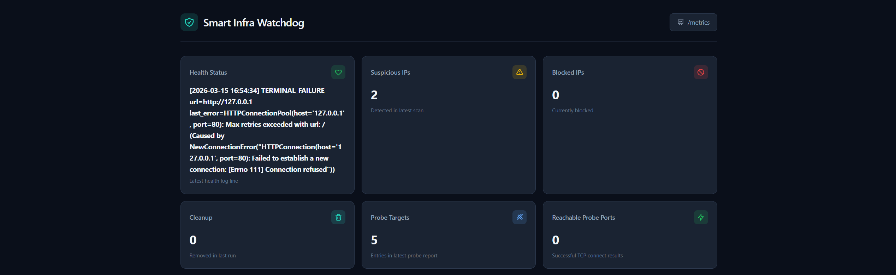


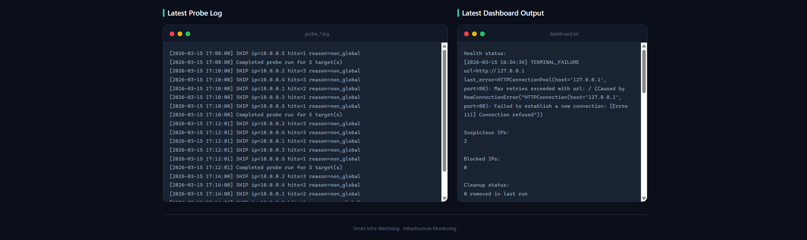

Prometheus metrics:

```text
http://127.0.0.1:5000/metrics
```

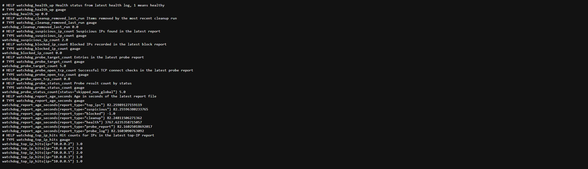

## Prometheus integration

```text
prometheus/prometheus.yml
```

The goal is Grafana to scrape the Flask metrics endpoint.

## Cron automation

```bash
crontab -l
journalctl -u cronie -f
```
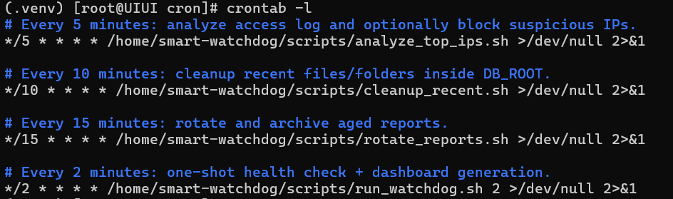

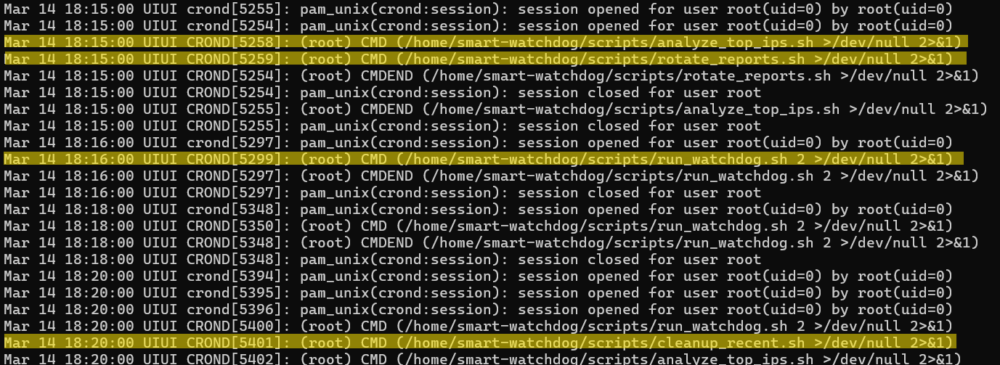

They automate:
- top-IP analysis
- cleanup
- report rotation
- one-shot watchdog runs
